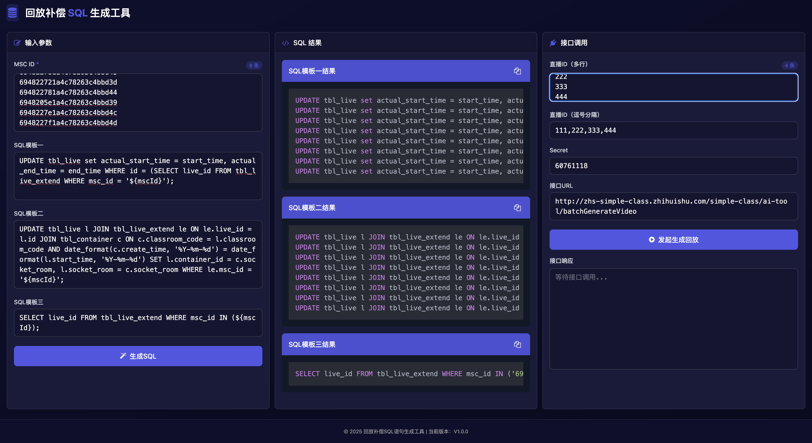

# 直播 ID 转视频 ID 查询工具

通过输入直播 ID 查询对应的视频 ID。


左侧输入直播 ID，以换行符或者逗号分割，点击「查询视频 ID」按钮会调用接口查询对应的视频 ID。返回结果会显示在右侧。

右侧显示直播 ID 以及对应的视频 ID。，每个视频 ID 可单独复制和全部批量复制。

支持查看结果条数和导出到本地 CSV 文件。

# 回放补偿 SQL 生成工具

用于回放补偿，比如直播结束后，没有生成回放视频，需要回放补偿的场景。



## 补偿流程：

1. 修改 `tbl_live` 表中的 `actual_start_time` 字段的值为 `start_time` 字段的值，`actual_end_time` 字段的值为 `end_time` 字段的值
2. 从 `tbl_container` 表中查询出容器 ID 赋值给 `tbl_live` 表的 `container_id` 字段和 `socket_room` 字段

## 实现流程：

1. 通过给定的一系列 mscId 批量生成更新修改 `actual_start_time` 和 `actual_end_time` 字段的 SQL 语句
2. 通过给定的一系列 mscId 批量生成更新修改 `container_id` 和 `socket_room` 字段的 SQL 语句
3. 通过给定的一系列 mscId 批量生成通过 mscId 查询 `live_id` 的 SQL 语句
4. 在线上数据库平台执行 1.2.生成的 SQL 语句
5. 在线上数据库平台执行 3.生成的 SQL 语句查询到对应的 `live_id`
6. 将 live_id 复制出来粘贴到右侧的直播 ID（多行）输入框中，会自动生成以逗号分割的 `live_id` 字符串
7. 点击「发起生成回放」按钮调用接口触发回放生成流程

## 页面介绍

### 输入参数

输入给定的 mscId，一行一个 mscId

### SQL 模板一

默认为生成修改 `actual_start_time` 和 `actual_end_time` 字段的 SQL 语句

### SQL 模板二

默认为生成更新 `container_id` 和 `socket_room` 字段的 SQL 语句

### SQL 模板三

默认为生成通过 mscId 查询 `live_id` 的 SQL 语句

以上三个模板的 SQL 语句都可以修改，需要填充的 mscId 用 `${mscId}` 表示。

如：

```sql
SELECT * FROM tbl_live_extend WHERE msc_id = '${mscId}';
```

### SQL 结果

默认会在下方显示生成的 SQL 语句结果。以模板分组，每组的 SQL 都可以单独复制。

### 接口调用

直播 ID（多行）输入的是从模板三生成的 SQL 语句查询到的 `live_id` ，一行一个 `live_id` 。输入 live_id 后会自动生成以逗号分割的 `live_id` 字符串填充下方的直播 ID（逗号分割）的输入框中。

接口 URL 输入框中填写发起回放生成的接口地址，点击「发生生成回放」按钮会调用接口触发回放生成流程。返回结果会显示在下方。
